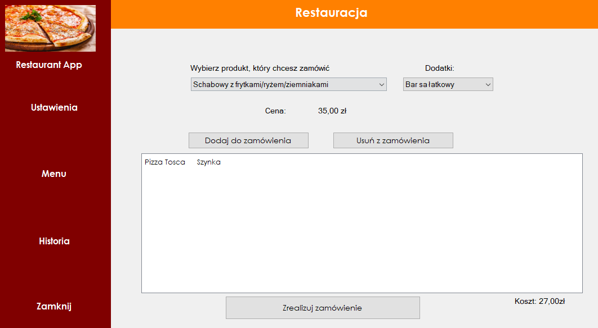
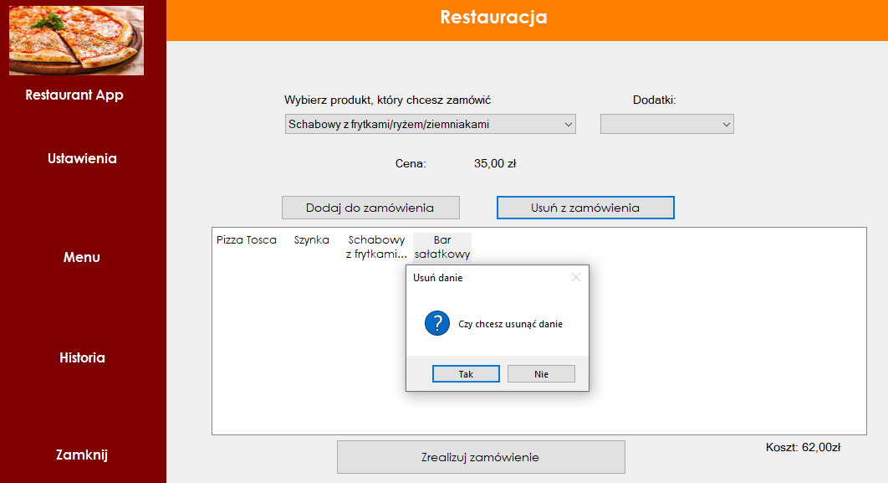
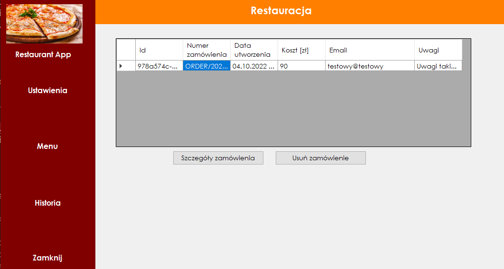
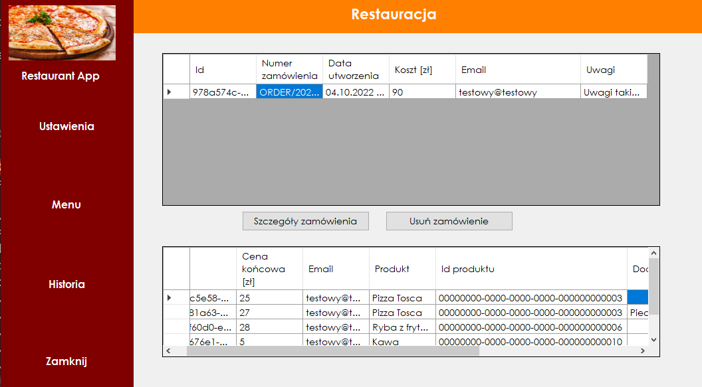

# Projekt
Solucję podzielono na 4 projekty. Projekt Domain przechowuje encje oraz interfejsy repozytoriów. Infrastructure jest projektem, który pobiera, modyfikuje dane z bazy danych. Główna logika aplikacji znajduje się w Application. Projekt UI ma za zadanie przedstawić użykownikowi dane odpowiednio przerobione przez Application. Do wymiany danych pomiędzy UI a Application służy interfejs IRequestHandler. W całej solucji zastosowano kontener IoC CastleWindsor. Dodatkowo projekt posiada testy integracyjne oraz jednostkowe. W solucji dodano projekt Migrations, którego zadaniem jest przechowywanie stanu o aktualnym modelu bazodanowym. Każda klasa ma określony priorytet podczas przeprowadzania migracji. Migracje są uruchamiane na starcie aplikacji. Biorąc pod uwagę .Net Framework 4.8 aktualnie w projekcie migracje przeprowadzane są po staremu. W przyszłości projekt zostanie podbity do nowszej wersji Net. Podczas podbijania wersji solucja prawdodobnie podzieli się na serwer aplikacji (Net 7) i klienta (WindowsForms, WPF czy MAUI)

Technologie:
- .Net Framework 4.8
- SQLite
- NUnit
- CastleWindsor
- Dapper
- WindowsForms
- FluentMigrator

Schemat projektu

Do zapisywania zamówień wykorzystano bazę SQLite. Baza danych została dodana lokalnie w projekcie. Ułożenie tabel pokazano na rysunku poniżej.

Schemat wraz z tabelami jest automatycznie tworzony podczas startu aplikacji

# Screen

